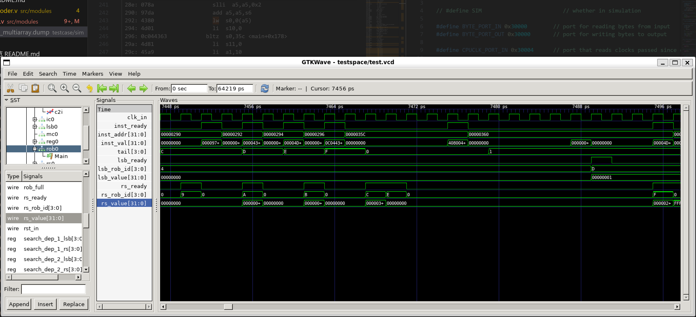

# RISCV-CPU 2024

## 仓库文件结构

```C++
📦BurningCPU
┣ 📂sim
┣ 📂src
┃ ┣ 📂modules
┃ ┣ 📂utils
┃ ┣ 📂common
┃ ┣ 📜cpu.v
┃ ┣ 📜hci.v
┃ ┗ 📜riscv_top.v
┣ 📜Makefile
┗ 📜README.md
```

## rv32c instruction set

RV32I：`LUI`, `AUIPC`, `JAL`, `JALR`, `BEQ`, `BNE`, `BLT`, `BGE`, `BLTU`, `BGEU`, `LB`, `LH`, `LW`, `LBU`, `LHU`, `SB`, `SH`, `SW`, `ADDI`, `SLLI`, `SLTI`, `SLTIU`, `XORI`, `SRLI`, `SRAI`, `ORI`, `ANDI`, `ADD`, `SUB`, `SLL`, `SLT`, `SLTU`, `XOR`, `SRL`, `SRA`, `OR`, `AND`

RV32C：`c.addi`，`c.jal`，`c.li`，`c.addi16sp`，`c.lui`，`c.srli`，`c.srai`，`c.andi`，`c.sub`，`c.xor`，`c.or`，`c.and`，`c.j`，`c.beqz`，`c.bnez`，`c.addi4spn`，`c.lw`，`c.sw`，`c.slli`，`c.jr`，`c.mv`，`c.jalr`，`c.add`，`c.lwsp`，`c.swsp`

all imm!=0, reg!=0

### 00 family

ls-type
inst|15-13|12-10|9-7|6-5|4-2|1-0
----|-----|------|---|---|---|---
c.lw|010|uimm[5:3]|rs1'|uimm[2,6]|rd'|00
c.sw|110|uimm[5:3]|rs1'|uimm[2,6]|rs2'|00

addi4spn-type
inst|15-13|12-5|4-2|1-0
----|-----|-----|---|---
c.addi4spn|000|nzuimm[5,4,9:6,2,3]|rd'|00

### 01 family

r-type
inst  | 15-12|11-10 | 9-7 | *6-5 | 4-2 | 1-0
------|------|--|--------|--------|-----|-----
c.sub | 1000|11 | rd'| 00 |rs2'|01
c.xor | 1000|11 | rd'| 01 |rs2'|01
c.or  | 1000|11 | rd'| 10 |rs2'|01
c.and | 1000|11 | rd'| 11 |rs2'|01

i-type
inst | 15-13 | 12 | *11-10 | 9-7 | 6-2 | 1-0
-----|--------|-----|--------|--------|--------|-----
c.srli|100|uimm[5]|00|rd'|uimm[4:0]|01
c.srai|100|uimm[5]|01|rd'|uimm[4:0]|01
c.andi|100|imm[5]|10|rd'|imm[4:0]|01

ai-type
inst|15-13|12|11-7|6-2|1-0
----|-----|--|-----|---|---
c.addi|000|nzimm[5]|rd|nzimm[4:0]|01
c.li|010|imm[5]|rd|imm[4:0]|01
c.addi16sp|011|imm[9]|rd=2|imm[4,6,8:7,5]|01
c.lui|011|imm[17]|rd!=2|imm[16:12]|01

j-type
inst|15-13|12-2|1-0
----|-----|-----|---
c.jal|001|imm[11,4,9:8,10,6,7,3:1,5]|01
c.j|101|imm[11,4,9:8,10,6,7,3:1,5]|01

bz-type
inst|15-13|12-10|9-7|6-2|1-0
----|-----|------|---|---|---
c.beqz|110|offset[8,4,3]|rs1'|offset[7,6,2,1,5]|01
c.bnez|111|offset[8,4,3]|rs1'|offset[7,6,2,1,5]|01

### 10-family

inst|15-13|12|11-7|6-2|1-0
----|-----|--|-----|---|---
c.slli|000|uimm[5]|rd|uimm[4:0]|10
c.lwsp|010|uimm[5]|rd|uimm[4:2,7:6]|10

inst|15-12|11-7|6-2|1-0
----|-----|-----|---|---
c.jr|1000|rs1|00000|10
c.mv|1000|rd|rs2!=0|10
c.jalr|1001|rs1|00000|10
c.add|1001|rd|rs2!=0|10

inst|15-13|12-7|6-2|1-0
----|-----|-----|---|---
c.swsp|110|uimm[5:2,7:6]|rs2|10

## 测试

```shell
make run_sim name=your_testcase_name
```

## CPU架构


with some modifications to reduce WNS

## 乱序执行 OoO



from testpoint 006_multiarray
